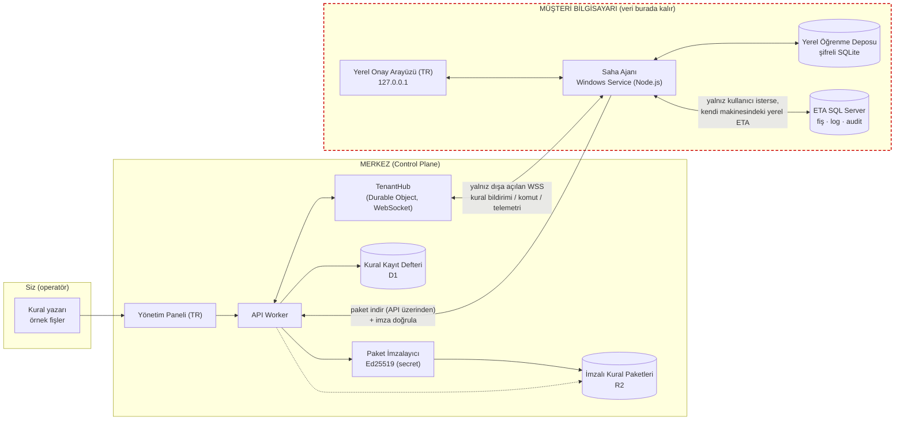
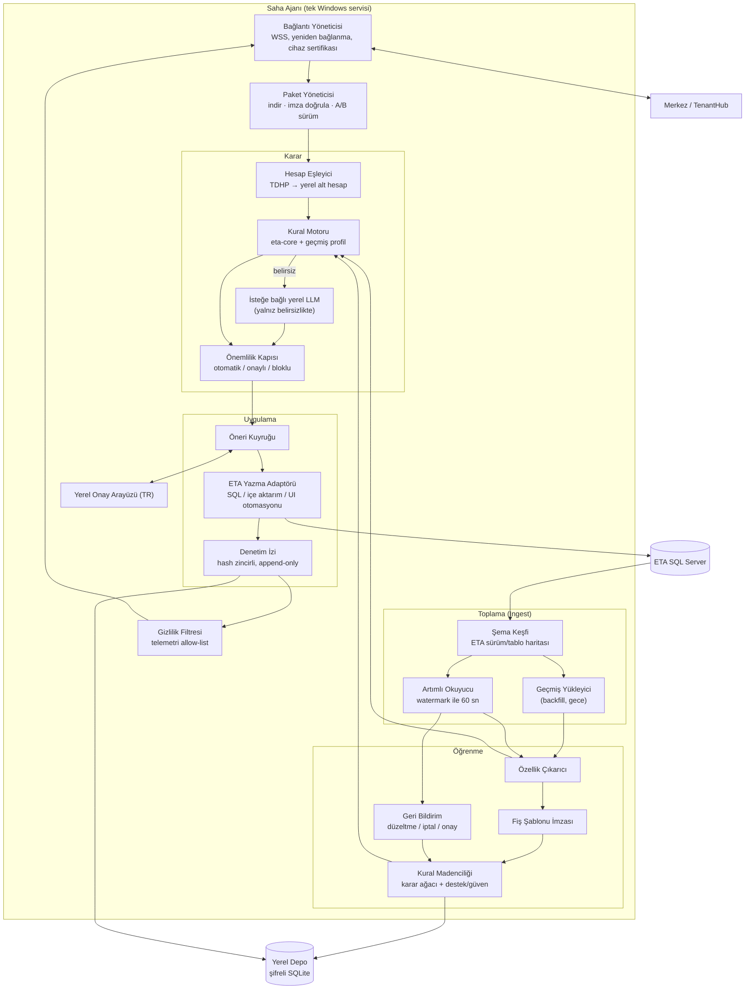
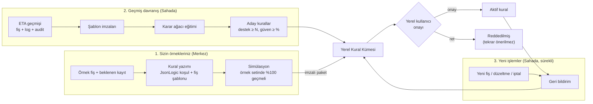
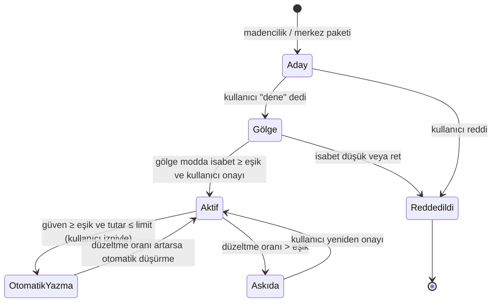
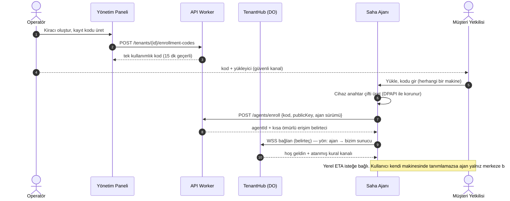
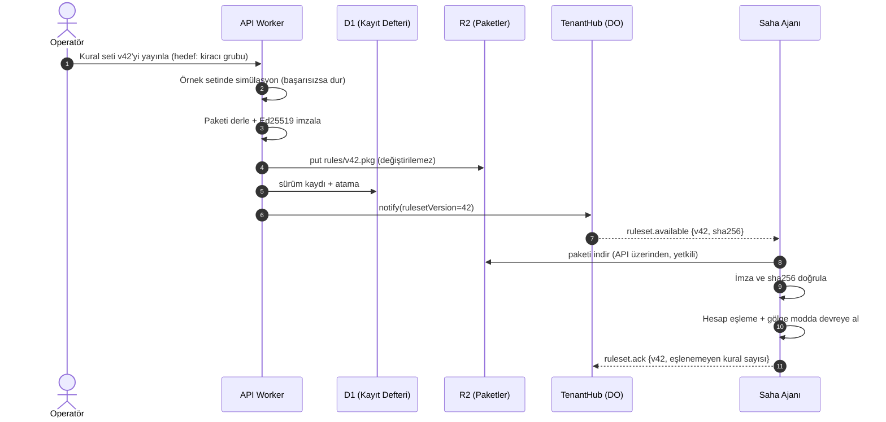

# Mimari

## 1. Temel ilke: veri sahada kalır, bilgi merkezden gelir

Sistem iki parçadan oluşur:

- **Merkez (Control Plane)**: Sizin işlettiğiniz sunucu. Kural kütüphanesi, örnek fişler,
  kiracı (müşteri) yönetimi, ajan kaydı, kural paketlerinin imzalanması ve dağıtımı burada
  yapılır. Varsayılan olarak muhasebe defteri merkeze gelmez. **Tek istisna:** kullanıcı
  Windows oturumuyla onaylarsa ajan, yalnız tiklenen alanları kısa ömürlü bir görünüme iter;
  web arayüzü onu gösterir. Ayrıntı: `docs/consent-and-view.md`.
- **Saha Ajanı (Edge Agent)**: Kullanıcının **kendi** kurduğu program. Herhangi bir
  makineden **bizim sunucuya** WSS ile bağlanır. Yerel ETA isteğe bağlıdır: kullanıcı
  kendi makinesinde kendi bağlantısını yazarsa ajan o makinedeki ETA ile konuşur. DENK
  bir ofis makinesine, SQL sunucusuna veya masaüstüne gitmez; ofis hesabı istemez.

Merkeze giden tek şey **içeriksiz telemetri**dir: ajan sağlığı, sayaçlar (kaç öneri, kaç
onay, kaç ret), kural kimliği bazında isabet oranı, hata kodları. Bu alanlar ajan tarafında
bir izin listesiyle (allow-list) sınırlandırılır.



Kırmızı kesikli çizgi **veri egemenliği sınırıdır**. Sınırın dışına telemetri ve, kullanıcı
Windows ile onayladıysa, ajanın ittiği kısa ömürlü izinli görünüm çıkar.

## 2. Bileşenler

### 2.1 Merkez

| Bileşen | Görev | Önerilen teknoloji |
|---|---|---|
| Yönetim Paneli | Kural yazma, örnek fiş girme, simülasyon, kiracı ve ajan yönetimi, sürüm yayınlama | Workers Static Assets + React (TR arayüz) |
| API Worker | Kimlik doğrulama, REST uç noktaları, ajan kaydı, paket yayınlama | Cloudflare Workers (TypeScript) |
| TenantHub | Her kiracı için bir Durable Object. Kiracının ajanlarının WebSocket bağlantılarını tutar, komut kuyruğu ve son telemetriyi saklar | Durable Objects + WebSocket Hibernation API |
| Kural Kayıt Defteri | Kural tanımları, sürümler, kiracıya atamalar, hesap planı şablonları (TDHP) | D1 |
| Paket Deposu | İmzalı, değiştirilemez kural paketleri ve ajan yükleyicileri | R2 |
| Paket İmzalayıcı | Kural paketini Ed25519 ile imzalar. Özel anahtar yalnız Cloudflare secret olarak durur | Worker içinde WebCrypto |

Doğrulanan platform davranışları (Cloudflare dokümanı):

- Hibernation API ile Durable Object boştayken bellekten atılır, WebSocket bağlantıları
  kopmaz. `setWebSocketAutoResponse` ile ping/pong nesneyi uyandırmadan cevaplanır.
- Bir Durable Object başına en fazla 32.768 WebSocket bağlantısı olabilir. Pratik sınırı
  CPU ve bellek belirler.
- D1 veritabanı başına 10 GB sınırı vardır ve artırılamaz. Bu yüzden telemetri D1'e ham
  olarak değil, günlük özet olarak yazılır (bkz. `volume.md`).

> Karar noktası: "Sunucu benim bilgisayarım olsun" tercihi için alternatif, aynı merkezi
> Node.js + PostgreSQL ile kendi makinenizde çalıştırıp Cloudflare Tunnel ile dışarı
> açmaktır. Merkez ince bir katman olduğu için iki seçenek de mümkün. SaaS için önerilen
> seçenek Cloudflare'dir: sizin makinenizde gelen port açılmaz ve ölçekleme hazır gelir.
> Hangisiyle ilerleyeceğimiz onayınıza bağlı.

### 2.2 Saha Ajanı



| Bileşen | Görev |
|---|---|
| Şema Keşfi | Yalnız kullanıcı kendi makinesinde yerel ETA'yı açtıysa: sürüm, şirket veritabanı ve tablo/kolon haritasını yerelde saklar. Tablo adları koda gömülmez. Kullanıcı açmazsa bu adım yoktur |
| Geçmiş Yükleyici | Aynı koşulla: seçilen yıllara ait fiş, satır, log ve audit kayıtlarını mesai dışında, küçük parçalar halinde okur |
| Artımlı Okuyucu | Aynı koşulla: son okunan kimlik ve zaman damgasına (watermark) göre yeni kayıtları okur. SQL Server Change Tracking varsayılan olarak **kullanılmaz** |
| Özellik Çıkarıcı | Fiş tipi, cari grup kodu, hesap kodu önekleri, açıklama kelimeleri, KDV oranı, tutar aralığı, ayın günü, kullanıcı gibi özellikleri üretir |
| Fiş Şablonu İmzası | Bir fişi tutardan bağımsız bir kalıba indirger. Örnek: `{770.*:B, 191.*:B, 320.*:A}` ve oranlar `{1.0, 0.2, 1.2}` |
| Kural Madenciliği | Bağlam özelliklerinden şablonu tahmin eden karar ağacı eğitir. Ağaç yollarını insan okunur aday kurallara çevirir; her kuralın desteği (kaç fiş) ve güveni (yüzde kaç doğru) hesaplanır |
| Geri Bildirim | Önerilen fişin ETA'da düzeltilmesi, iptali veya aynen kalması log ve audit kayıtlarından yakalanır. Kural güveni buna göre güncellenir, gerekirse istisna kuralı doğar |
| Hesap Eşleyici | Merkezden gelen genel kurallar TDHP ana hesaplarıyla (ör. `191`) yazılır. Ajan bunları müşterinin alt hesaplarına (ör. `191.01.001`) geçmiş kullanım sıklığına göre eşler |
| Kural Motoru | Öncelik sırası: yerel onaylı kural, merkez kuralı, yerel aday kural (yalnız öneri) |
| Önemlilik Kapısı | Tutar eşiği, kural güveni ve kural durumuna göre otomatik yaz, onaya sun veya blokla kararı verir |
| ETA Yazma Adaptörü | Üç strateji arkasında tek arayüz. Hangisinin kullanılacağına Faz 0'daki keşiften sonra karar verilir (bkz. 5. bölüm) |
| Denetim İzi | Her öneri, karar, yazma ve geri alma işlemini hash zinciriyle yerelde saklar |
| Gizlilik Filtresi | Merkeze giden her mesajı şemaya göre doğrular; izin listesinde olmayan alanı düşürür ve olayı yerel denetim izine yazar |

## 3. Öğrenme hattı

Üç kaynaktan kural doğar ve tek bir kural modelinde birleşir.



Kural yaşam döngüsü:



- **Gölge mod**: Kural öneri üretir ama hiçbir şey yazmaz. Gerçek kullanıcının ETA'ya
  girdiği fişle karşılaştırılır. Böylece güven, müşterinin kendi verisinde, risk
  almadan ölçülür.
- Bir kural hiçbir zaman kendi kendine `OtomatikYazma` durumuna geçmez. Bu geçiş için
  müşteri tarafında yetkili kullanıcı onayı gerekir.

## 4. Ana akışlar

### 4.1 Ajan kaydı (enrollment)



### 4.2 Kural yayınlama ve sahaya uygulama



### 4.3 Yeni işlemde öneri, onay ve yazma

```mermaid
sequenceDiagram
    autonumber
    participant ETA as ETA SQL Server
    participant AG as Saha Ajanı
    participant ENG as Kural Motoru
    participant GATE as Önemlilik Kapısı
    actor KU as Müşteri Kullanıcısı
    participant AUD as Denetim İzi

    opt Kullanıcı kendi makinesinde yerel ETA'yı açtıysa
        loop her 60 sn
            AG->>ETA: SELECT ... WHERE id > watermark
            ETA-->>AG: yeni fatura / cari hareket / log
        end
    end
    AG->>ENG: özellikler
    ENG-->>AG: fiş şablonu + kural kimliği + güven
    AG->>GATE: tutar, güven, kural durumu
    alt otomatik yazma izni var
        GATE-->>AG: OTOMATIK
    else
        GATE-->>AG: ONAY_GEREKLI
        AG->>KU: Yerel arayüzde öneri
        KU-->>AG: Onayla / Düzelt / Reddet
    end
    opt Kullanıcı kendi makinesinde yerel yazmayı açtıysa
        AG->>ETA: BEGIN TRAN · fiş yaz · doğrula · COMMIT
    end
    AG->>AUD: kayıt (öneri, karar, sonuç, önceki hash)
    Note over AG,KU: Yerel ETA yoksa ajan yalnız plan ve telemetri üretir; bir ofis SQL'ine gitmez
```

### 4.4 Windows onayı ile izinli web görünümü

Asıl gösterim yolu. AI makineye gitmez; ajan zaten bize bağlıdır.

```mermaid
sequenceDiagram
    autonumber
    actor AI as Sunucudaki AI
    participant WEB as Web arayüzü
    participant HUB as TenantHub
    participant AG as Saha Ajanı
    actor KU as Windows oturumu

    AI->>WEB: Bu fişi görmek istiyorum
    WEB->>HUB: consent.request (gerekçe + alan listesi)
    HUB-->>AG: aynı istek (açık WSS, ajan → biz)
    AG->>KU: Windows kimliği + alan kutuları
    KU-->>AG: Onayla (SID, hesap; parola yok) veya Reddet
    alt onay
        AG->>HUB: consent.granted + view.chunk (yalnız izinli alanlar)
        HUB-->>WEB: view.ready
        WEB->>AI: tablo (izinli kolonlar)
    else red
        AG->>HUB: consent.denied
        HUB-->>WEB: boş görünüm
    end
```

Ayrıntı ve çalışan gösterim: `docs/consent-and-view.md`, `packages/consent-view`.

## 5. ETA'ya yazma stratejileri

Üç yol teorik olarak aynı arayüzün arkasında durur. Hangisinin kullanılacağı, kullanıcı
kendi makinesinde yerel yazmayı açarsa ve o makinede neyin çalıştığı görülürse karar
verilir. DENK bir ofis SQL makinesi seçmez ve oraya bağlanmaz.

| Strateji | Artı | Eksi / risk |
|---|---|---|
| A. Resmi içe aktarım (Excel/XML) | ETA'nın kendi doğrulamalarından geçer, destek riski en düşük | Varlığı ve sürüm kapsamı **doğrulanmadı**; otomasyonu sınırlı olabilir |
| B. Doğrudan SQL (transaction içinde) | Hızlı, tam kontrol | Fiş numarası, bakiye ve entegrasyon tablolarının tutarlılığı bizim sorumluluğumuzda; ETA güncellemesinde kırılabilir; lisans ve destek şartlarına uygunluğu **doğrulanmadı** |
| C. UI otomasyonu | ETA'nın iş kurallarını birebir kullanır | Yavaş, kırılgan, oturum açık kullanıcı gerekir |

Arşivdeki onaylı işlemler strateji B'nin **mantığını** gösterir (şablon klon + tek
transaction + mizan rebuild). DENK bir ofis sunucusuna bağlanarak bunu yapmaz. Kullanıcı
kendi makinesinde yazmayı açarsa çekirdek aynı mantığı yerelde uygular: yedek kontrolü,
tek transaction, borç/alacak ve hex denetimi, REF bazlı geri alma. Yapay zeka SQL yazmaz.

## 6. Önerilen depo iskeleti (monorepo)

```
.
├── apps/
│   ├── control-plane/            # henüz yok — Cloudflare Worker
│   └── admin-ui/                 # VAR: sıfırdan React, DENKWEB değil
├── agent/                        # henüz yok — öneri: Node.js Windows servisi
├── packages/
│   ├── eta-core/                 # VAR: deterministik kural + yazıcı (DB yok)
│   └── consent-view/             # VAR: Windows onayı + izinli görünüm
├── docs/
└── .env.example
```

`packages/eta-core` hem merkez simülasyonunda hem saha ajanında aynı kod olarak çalışır.
Yapay zeka yalnızca bu paketin planlayıcılarını çağırır.
