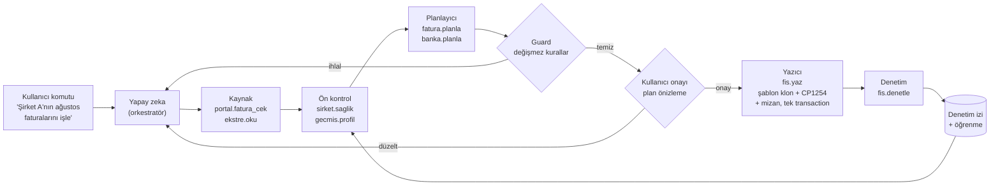

# DENK Yöntemi: Kanıtlı Kural, Şablon Klon, Plan → Onay → Yaz → Denetle

Bu doküman, DENK arşivindeki onaylı işlemlerden ve başarısız denemelerden çıkarılan
çalışma yöntemidir. Amaç, kullanıcıların ETA işlemlerini (alış/satış faturası, banka
ekstresi, geri alma, şirket sağlık kontrolü) güvenle yapan bir yapay zeka ajanıdır.

## 1. İlke

1. **Yapay zeka SQL yazmaz.** Doğal dil komutunu anlar, doğru yeteneği seçer, belirsizlikte
   soru sorar ve bir **plan** üretir.
2. **Tutarı ve hesabı kural motoru belirler.** Kural motoru deterministiktir ve onaylı
   işlemlere karşı test edilmiştir.
3. **Yazmadan önce değişmez kurallar (guard) çalışır.** Tek bir ihlal varsa yazma yapılmaz.
4. **Şirketin kendi geçmişi şablondur.** ETA kolonları sabit kodlanmaz. Aynı şirketin, aynı
   fiş tipindeki son sağlam fişi klonlanır, yalnızca anlamlı alanlar değiştirilir.
5. **Her yazma geri alınabilir ve denetlenir.** Tek transaction, mizan yeniden hesaplama,
   yazma sonrası denetim raporu, REF bazlı geri alma.

## 2. Akış

## 3. Yetenek kataloğu

Yapay zekanın çağırabileceği tek şey bu yeteneklerdir. Her biri tipli girdi ve çıktı alır,
her çağrı denetim izine yazılır.

| Yetenek | Ne yapar | Yazar mı | Durum |
|---|---|---|---|
| `portal.fatura_cek` | Entegratör portalından ay bazında gelen/giden e-fatura XML'lerini indirir | Hayır (yalnız dosya) | Intecon HTTP akışı kanıtlı, eLogo tarayıcı otomasyonu gerekli |
| `fatura.oku` | UBL-TR XML'den evrak no, tarih, taraflar, matrah, KDV, payable, kalemler, notlar | Hayır | Çekirdekte yapılacak |
| `ekstre.oku` | Excel ekstreyi hücre değeriyle (`Value2`) okur, Türkçe tutar biçimini doğru çevirir | Hayır | `parseTrAmount` çekirdekte hazır |
| `sirket.saglik` | Path tutarlılığı, `ISYKART` kimliği, `SIRCALFLAG`, `SABITLER` e-fatura yolları, `ISLGIBTAN` havuzu | Hayır | Kural 03, 08 ve 17'den |
| `gecmis.profil` | Şirketin son 1-2 ayı: karşı hesap dağılımı, açıklama kalıpları, KKEG/tevkifat kullanımı, fiş gruplama stili, başlık alan değerleri | Hayır | Öğrenme katmanının kalbi |
| `fatura.planla` | Kural 13, 16, 18, 19 ile fiş planı | Hayır | Binek bakım ve genel gider çekirdekte hazır |
| `banka.planla` | Kural 02, 15, 18 ile DEK planı | Hayır | Aylık tek fiş modu çekirdekte hazır |
| `plan.denetle` | Değişmez kurallar (bkz. 5. bölüm) | Hayır | Çekirdekte hazır |
| `fis.yaz` | Şablon klon, REF/fiş no, CP1254, mizan yeniden hesaplama, borç=alacak, tek transaction | **Evet** | Satır üretici çekirdekte hazır. Canlı yazma yalnız kullanıcı kendi makinesinde yerel ETA'yı açarsa |
| `fis.denetle` | Yazma sonrası: satır sayıları, görünürlük alanları, hex, mizan denkliği | Hayır | Onaydan sonra |
| `fis.geri_al` | Yalnız verilen REF: satırlar, başlık, o ayın mizanı | **Evet** | Onaydan sonra |

## 4. Öğrenme: "davranıştan kural"

Kullanıcının istediği öğrenme, DENK kurallarında zaten tarif edilmiş: **kural 01.5,
"önceki 2 ayın geçmiş kayıtlarına bak"**. Bunu elle değil, `gecmis.profil` yeteneğiyle
otomatik yapıyoruz:

| Öğrenilen | Nereden | Nerede kullanılır |
|---|---|---|
| Tedarikçi → gider hesabı | aynı VKN'li önceki faturaların gider satırı | `fatura.planla` önerisi |
| Banka işlem tipi → karşı hesap | önceki ayların DEK satırları | `banka.planla` özel eşleme listesi |
| Açıklama kalıbı (`İND.KDV.`) | ofis yazımı; sapma varsa geçmişte işaretlenir | KDV satırı |
| Fiş gruplama (ayda tek / işlem başına) | önceki DEK fişlerinin sayısı ve tarihleri | çelişki Ç8'i şirket bazında çözer |
| Başlık/satır sabit alanları | aynı `MUHFISBELTUR` + `MUHFISOZELKOD1` son fiş | `fis.yaz` şablonu, çelişki Ç9'u çözer |
| Onay / düzeltme / geri alma | DENK denetim izi | kuralın güveni, bir sonraki önerinin önceliği |

Öğrenilen her şey **öneri** olarak gelir. Yeni bir kalıp ilk kez uygulanacaksa plan
önizlemesinde "bu şirkette ilk kez" diye işaretlenir.

## 5. Değişmez kurallar (guard)

Bu kurallar kodda test edilmiştir (`packages/eta-core/src/guards.ts`). Kaynağı DENK kural
numarasıdır.

| Kod | Kural | Kaynak |
|---|---|---|
| `BALANCE` | Toplam borç = toplam alacak (kuruş) | 02, 19 |
| `NO_296` | `296` hesabı kullanılmaz | 02, 15 |
| `BABS_EMPTY` | `MUHHARVKNTCKNO` boş | 06, 09 |
| `NO_ASCII_TURKISH` | `N.FT ILE`, `SATIS`, `ALIS`, `IND.KDV` gibi ASCII'leştirilmiş yazım yok | 01.7 |
| `NO_ALIM_TEXT` | Satır açıklamasında `ALIM` yok | 13 |
| `CP1254_SAFE` | Tüm metinler CP1254'e kayıpsız çevrilir | 19 |
| `DESC_MAX_LEN` | Açıklama CP1254 bayt olarak kolon sınırını aşmaz | 19 |
| `DOC_DATE_SET` | Evrak tarihi boş veya 1900 değil | 18 |
| `LINE_DATES_CHRONO` | Satırlar tarih sırasında | 18 |
| `HEADER_DATE_RULE` | Tek mahsupta `MUHFISTAR` ayın son günü; münferit faturada fatura tarihi | 18 |
| `LINE_KEEPS_ORIGINAL_TIME` | Tek mahsupta `MUHHARTAR` / `MUHHAREVRAKTAR` işlemin kendi tarih ve saati; ayın son günü satırlara kopyalanmaz | 18 |
| `FAT_30K_NOT_CASH` | Alış faturası ≥ 30.000 TL ise kapanış kasa (`100 …`) olamaz | 13 |
| `BANK_NO_FAT_RULES` | DEK satırında `N.FT İLE` açıklaması yok | 15 |
| `POSITIVE_AMOUNTS` | Satır tutarları sıfırdan büyük | 02 |
| `SINGLE_COMPANY` | Plan tek şirket veritabanını hedefler | 01.2 |

Veritabanına bağlı ek kontroller (`fis.yaz` içinde, onaydan sonra): mükerrer evrak no,
REF ve fiş no benzersizliği, yazma sonrası hex ve satır sayısı, mizan denkliği.

### Tek mahsup fişi (Kural 18)

Ayda bir DEK / dönem fişi yazılırken:

| Alan | Değer |
|---|---|
| `MUHFISTAR` (fiş tarihi) | Ayın son takvim günü. Saat fiş saati (`MUHFISSAAT`), işlem saati değil. |
| `MUHHARTAR` (satır tarihi) | İşlemin kendi tarihi ve saati. Ayın son günü buraya kopyalanmaz. |
| `MUHHAREVRAKTAR` (evrak tarihi) | Aynı orijinal an. Boş veya 1900 yasak. |
| Sıra | Kronolojik: ayın 1'inden son güne, aynı günde saate göre. |

Münferit fatura bu kuralın dışındadır: başlık ve satır, faturanın kendi tarihidir.

## 6. Hangi yapay zeka?

Görev ikiye ayrılır ve ikisi aynı model olmak zorunda değildir:

1. **Orkestratör:** Türkçe komutu anlar, yetenekleri sırayla çağırır, kullanıcıya planı
   açıklar. Araç çağırma (tool calling) yeteneği güçlü bir büyük dil modeli gerekir.
2. **Sınıflandırıcı:** Belirsiz durumlarda (bu fatura binek araç mı, ticari mal mı; bu
   ekstre satırı hangi cari) öneri verir. Her öneri gerekçe ve güven puanı taşır; tutarı
   hiçbir zaman model hesaplamaz.

Veri gizliliği için varsayılan olarak modele yalnızca gereken alanlar gider (kalem adı,
fatura notu, şirket geçmişinden hesap adayları). Tutar, VKN ve cari adı modele gönderilmeden
de sınıflandırma yapılabilir. Bulut model mi, müşteri makinesinde yerel model mi
kullanılacağı KVKK açısından bir karardır ve onayınıza bağlıdır (bkz. `roadmap.md`).

## 7. Mevcut DENKWEB ile ilişki

DENKWEB (Node.js) çalışan bir arayüz ve SQL köprüsüne sahip. Bu yöntem onu bozmaz:

- `packages/eta-core` saf TypeScript'tir, veritabanı bağlantısı içermez. DENKWEB'in
  `eta_sql_bridge.js` katmanından veya yeni saha ajanından aynı şekilde çağrılabilir.
- Aynı çekirdek, merkez tarafında kural simülasyonu için de kullanılır (Cloudflare Workers
  TypeScript çalıştırır). Böylece kural hem merkezde hem sahada tek kod tabanından çalışır.
- Bu nedenle saha ajanı için önceki tasarımdaki .NET yerine **Node.js/TypeScript**
  öneriyorum: DENKWEB ile aynı çalışma zamanı, tek kural kodu. Karar onayınıza bağlı.
