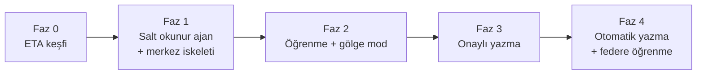

# Yol Haritası

Fazlar bağımlılık sırasına göre dizildi. Her faz bir önceki fazın çıktısına dayanır.

## Faz 0: ETA keşfi (kısmen tamam)

DENK ofis arşivinden tablo adları, kolonlar, CP1254, REF/`MA-` üretimi ve onaylı iki işlem
doğrulandı (`docs/denk-analysis.md`). `packages/eta-core` bu kanıta göre yazıldı.

Kalan keşif (hedef makinede, yalnız okuma):

- Banka altın örneğinin canlı fiş gruplaması (script ile log çelişiyor).
- `MUHMIZDEGER` döviz / `MUHRAKTIP` çeşitleri.
- `volume.md` okuma hızı ve disk tahminlerinin ölçümü.
- ETA/bayi yazılı teyidi (doğrudan SQL yazımı).

## Faz 1: Salt okunur ajan ve merkez iskeleti

- Merkez: API Worker, TenantHub Durable Object, D1 migration'ları (staging), ajan kaydı,
  Türkçe yönetim paneli iskeleti.
- Ajan: Windows servisi, enrollment, WSS bağlantısı, şema keşfi, geçmiş yükleyici,
  artımlı okuyucu, gizlilik filtresi, telemetri.
- `packages/protocol` şemaları.

Kabul ölçütü: ajan bir ETA kopyasını okur, merkeze yalnız sayaç gönderir. Gizlilik
filtresi testleri yasaklı alanların hiçbirinin çıkmadığını kanıtlar.

## Faz 2: Öğrenme ve gölge mod

- Merkez: kural editörü, örnek fiş seti, simülasyon, paket imzalama ve yayınlama.
- Ajan: `gecmis.profil`, `fatura.planla` / `banka.planla` (eta-core), gölge mod
  karşılaştırması, yerel onay arayüzünde plan önizlemesi.

Kabul ölçütü: gölge modda, kullanıcıların gerçekte girdiği fişlerle karşılaştırılan
isabet oranı kural bazında raporlanır.

## Faz 3: Onaylı yazma

- `fis.yaz` (şablon klon + CP1254 + mizan), önemlilik kapısı, öneri kuyruğu, geri alma.
- Hash zincirli denetim izi ve günlük zincir başı gönderimi.
- ETA'daki düzeltme ve iptallerden geri bildirim döngüsü.

Kabul ölçütü: onaylanan fişler ETA'da borç/alacak dengeli oluşur, geri alma çalışır,
düzeltmeler kural güvenini düşürür.

## Faz 4: Otomatik yazma ve federe öğrenme

- Kullanıcı izniyle otomatik yazma, düzeltme oranı artınca otomatik düşürme.
- İsteğe bağlı: Flower ile müşteriler arasında veri paylaşmadan model ağırlığı birleştirme.
  Yalnızca açık izin veren kiracılar katılır.
- İsteğe bağlı: belirsiz sınıflandırma için yerel LLM (Ollama).

## Onay bekleyen kararlar

1. Merkez nerede çalışacak: Cloudflare (önerilen) veya sizin bilgisayarınız + Cloudflare Tunnel.
2. Desteklenecek ETA sürümleri: ETA:SQL, V.8-SQL, V.11-SQL, hepsi mi?
3. ETA'ya yazma yolu: ofis pratiği doğrudan SQL; ETA/bayi teyidi hâlâ gerekli.
4. Ajanın kurulacağı yer: ETA istemci bilgisayarı mı, SQL Server makinesi mi?
5. Operatör kimlik doğrulaması: Cloudflare Access mi, ayrı IdP mi?
6. Faz 0 kalan keşif için salt okunur ETA erişimi (banka fiş gruplaması + mizan tipleri).
7. Ajan çalışma zamanı: Node.js (önerilen, `eta-core` ile aynı) mı, .NET mi?
8. Yapay zeka nerede çalışacak: bulut model mi, ofis makinesinde yerel model mi?
