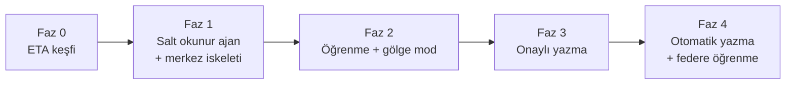

# Yol Haritası

Fazlar bağımlılık sırasına göre dizildi. Her faz bir önceki fazın çıktısına dayanır.

## Faz 0: ETA keşfi (hedef makinede, yalnız okuma)

Amaç: tahminleri gerçek veriyle değiştirmek.

- Test veya kopya bir ETA veritabanında şema dökümü (`sys.tables`, `sys.columns`).
- Muhasebe fişi, fatura, cari hareket, log ve audit tablolarının haritalanması.
- Log saklama süresi ve log olaylarının anlamı (oluşturma, düzeltme, iptal).
- Fiş ve evrak numarası üretim mantığı.
- Yazma stratejisi kararı: içe aktarım, doğrudan SQL veya UI otomasyonu.
- `volume.md` içindeki okuma hızı, satır oranı ve disk tahminlerinin ölçümü.

Çıktı: sürümlü ETA şema haritası ve yazma stratejisi kararı.

## Faz 1: Salt okunur ajan ve merkez iskeleti

- Merkez: API Worker, TenantHub Durable Object, D1 migration'ları (staging), ajan kaydı,
  Türkçe yönetim paneli iskeleti.
- Ajan: Windows servisi, enrollment, WSS bağlantısı, şema keşfi, geçmiş yükleyici,
  artımlı okuyucu, gizlilik filtresi, telemetri.
- `packages/protocol` şemaları ve iki tarafta üretilen tipler.

Kabul ölçütü: ajan bir ETA kopyasını okur, merkeze yalnız sayaç gönderir. Gizlilik
filtresi testleri yasaklı alanların hiçbirinin çıkmadığını kanıtlar.

## Faz 2: Öğrenme ve gölge mod

- Merkez: kural editörü, örnek fiş seti, simülasyon, paket imzalama ve yayınlama.
- Ajan: özellik çıkarma, şablon imzası, karar ağacıyla kural madenciliği, hesap eşleyici,
  JsonLogic motoru, gölge mod karşılaştırması, yerel onay arayüzünde aday kural listesi.

Kabul ölçütü: gölge modda, kullanıcıların gerçekte girdiği fişlerle karşılaştırılan
isabet oranı kural bazında raporlanır.

## Faz 3: Onaylı yazma

- Seçilen yazma adaptörü, önemlilik kapısı, öneri kuyruğu, geri alma.
- Hash zincirli denetim izi ve günlük zincir başı gönderimi.
- ETA'daki düzeltme ve iptallerden geri bildirim döngüsü.

Kabul ölçütü: onaylanan fişler ETA'da borç/alacak dengeli oluşur, geri alma çalışır,
düzeltmeler kural güvenini düşürür.

## Faz 4: Otomatik yazma ve federe öğrenme

- Kullanıcı izniyle otomatik yazma, düzeltme oranı artınca otomatik düşürme.
- İsteğe bağlı: Flower ile müşteriler arasında veri paylaşmadan model ağırlığı birleştirme.
  Yalnızca açık izin veren kiracılar katılır.
- İsteğe bağlı: açıklama metinleri için yerel LLM (Ollama).

## Onay bekleyen kararlar

1. Merkez nerede çalışacak: Cloudflare (önerilen) veya sizin bilgisayarınız + Cloudflare Tunnel.
2. Desteklenecek ETA sürümleri: ETA:SQL, V.8-SQL, V.11-SQL, hepsi mi?
3. ETA'ya yazma yolu: Faz 0 sonucuna göre, ETA/bayi teyidiyle.
4. Ajanın kurulacağı yer: ETA istemci bilgisayarı mı, SQL Server makinesi mi?
5. Operatör kimlik doğrulaması: Cloudflare Access mi, ayrı IdP mi?
6. Faz 0 için erişilebilecek anonimleştirilmiş veya test amaçlı bir ETA veritabanı var mı?
