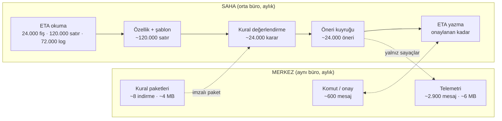
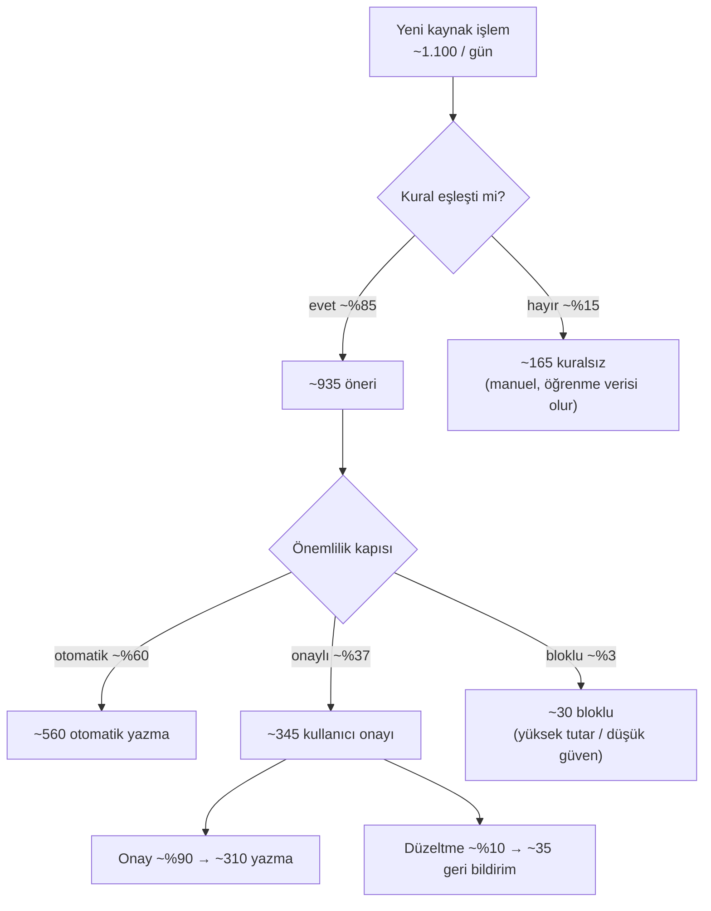

# İşlem Hacmi Modeli

Bu dokümandaki fiş sayıları, satır oranları ve okuma hızları **varsayımdır**. Faz 0'da
gerçek bir müşteri veritabanında ölçülüp güncellenecek. Cloudflare sınırları resmi
dokümandan alındı (2026-09-23).

## 1. Tasarımın kritik özelliği

Merkezin yükü **ajan sayısıyla** büyür, **fiş sayısıyla büyümez**. Çünkü fiş, log ve audit
verisi sahada işlenir. Merkeze yalnızca sabit boyutlu sayaçlar ve kural bazlı istatistikler
gider. Ağır iş (geçmiş yükleme, eğitim, öneri üretme, yazma) müşterinin makinesinde yapılır.

## 2. Saha profilleri (ajan başına)

Varsayımlar: ayda 22 iş günü, fiş başına ortalama 5 satır, fiş başına 3 log olayı, ay
sonu ve beyanname döneminde günlük hacim 3 katına çıkar, yoğun saat günün %25'ini taşır.

| Metrik | Küçük firma | Orta büro | Büyük büro |
|---|---:|---:|---:|
| ETA şirket sayısı | 1 | 40 | 150 |
| Şirket başına fiş / ay | 300 | 600 | 800 |
| **Fiş / ay** | 300 | 24.000 | 120.000 |
| Fiş satırı / ay | 1.500 | 120.000 | 600.000 |
| Log olayı / ay | 900 | 72.000 | 360.000 |
| Fiş / iş günü (normal) | ~14 | ~1.100 | ~5.450 |
| Fiş / gün (ay sonu, ×3) | ~41 | ~3.300 | ~16.400 |
| Fiş / dakika (yoğun saat) | <1 | ~14 | ~68 |

### 2.1 Geçmiş yükleme (backfill): 5 yıl

| Metrik | Küçük firma | Orta büro | Büyük büro |
|---|---:|---:|---:|
| Fiş | 18.000 | 1.440.000 | 7.200.000 |
| Fiş satırı | 90.000 | 7.200.000 | 36.000.000 |
| Log olayı (saklanmışsa) | 54.000 | 4.320.000 | 21.600.000 |
| **Toplam okunacak satır** | ~162.000 | ~12.960.000 | ~64.800.000 |
| Okuma süresi (2.000 satır/sn kısıtlı) | ~1,5 dk | ~1,8 saat | ~9 saat |
| Plan | tek seferde | 1-2 gece | 3-5 gece (mesai dışı pencerede) |
| Yerel depo (özellik + indeks, ~%30 indeks payı) | ~50 MB | ~4 GB | ~20 GB |

Tahmini kayıt boyutları: satır özelliği ~300 B, fiş başlığı ~200 B, log olayı ~150 B.

Kurallar:

- Okuma hızı ajan ayarıyla sınırlanır (varsayılan 2.000 satır/sn, 5.000 satırlık
  parçalar). ETA kullanıcıları çalışırken okuma otomatik yavaşlar.
- Büyük büroda yerel depo 20 GB'a çıkabilir. Bu yüzden 3 yıldan eski satırlar ham olarak
  değil, şablon imzası ve sayaç olarak sıkıştırılmış halde tutulur. Hedef boyut 8 GB
  altıdır. Kurulumda en az 30 GB boş disk kontrol edilir.
- Log kayıtlarının ETA'da ne kadar süre saklandığı bilinmiyor. Faz 0'da ölçülecek.

### 2.2 Sürekli çalışma (ajan başına, orta büro)

| İş | Sıklık | Hacim | Beklenen süre |
|---|---|---|---|
| Artımlı okuma | 60 sn | normalde ~2 fiş/dk, ay sonu ~14 fiş/dk | < 1 sn / tur |
| Kural değerlendirme | fiş başına | ~1.100 / gün | < 5 ms / fiş |
| Yerel LLM (isteğe bağlı) | yalnız belirsiz fiş | hedef < %5 → ~55 / gün | 1-5 sn / fiş (donanıma bağlı) |
| Artımlı madencilik | gece | günün fişleri | dakikalar |
| Tam yeniden eğitim | haftalık | ~1,44 M fiş | onlarca dakika (Faz 0'da ölçülecek) |
| Denetim izi | her karar | ~1.100-3.300 kayıt / gün | < 1 ms / kayıt |

### 2.3 Otomasyon hunisi (hedef, orta büro, günlük)

Oranlar olgun bir müşteri için hedeftir. İlk ay tüm kurallar gölge modda başlar ve
otomatik yazma oranı %0'dır.

## 3. Merkez hacmi

### 3.1 Ajan başına günlük mesaj bütçesi

| Mesaj | Sıklık | Adet / gün | Boyut | Bayt / gün | Durable Object'i uyandırır mı |
|---|---|---:|---:|---:|---|
| Ping/pong | 30 sn | 2.880 | ~10 B | ~29 KB | **Hayır** (`setWebSocketAutoResponse`) |
| Telemetri özeti | 15 dk | 96 | ~2 KB | ~192 KB | Evet |
| Komut + onay | olay bazlı | ~20 | ~1 KB | ~20 KB | Evet |
| Kural paketi bildirimi + ack | haftada ~2 | ~0,3 | ~1 KB | ~0,3 KB | Evet |
| Kural paketi indirme | haftada ~2 | ~0,3 | ~500 KB | ~140 KB | Hayır (R2, Worker üzerinden) |
| Günlük denetim özeti | günde 1 | 1 | ~10 KB | ~10 KB | Evet |
| **Toplam** | | **~117 uyandıran** | | **~0,39 MB** | |

### 3.2 Ölçek senaryoları

Kiracı başına ortalama 1,5 ajan, kiracı başına aktif 50 kural varsayıldı.

| Metrik | 10 ajan | 100 ajan | 1.000 ajan | 10.000 ajan |
|---|---:|---:|---:|---:|
| Kiracı (TenantHub DO) sayısı | ~7 | ~67 | ~667 | ~6.667 |
| Eşzamanlı WebSocket | 10 | 100 | 1.000 | 10.000 |
| DO'yu uyandıran mesaj / gün | ~1.200 | ~11.700 | ~117.000 | ~1,17 M |
| Ortalama istek / sn (tüm sistem) | ~0,01 | ~0,14 | ~1,4 | ~13,5 |
| Uyandırmayan ping / gün | 28.800 | 288.000 | 2,88 M | 28,8 M |
| Merkeze giriş trafiği / gün | ~4 MB | ~39 MB | ~390 MB | ~3,9 GB |
| D1 satır yazımı / gün (kiracı günlük özeti) | ~7 | ~67 | ~667 | ~6.667 |
| D1 büyümesi / yıl (~2 KB özet satırı) | ~5 MB | ~49 MB | ~490 MB | ~4,9 GB |
| DO SQLite sıcak veri / kiracı (90 gün) | ~5 MB | ~5 MB | ~5 MB | ~5 MB |

Kiracı başına DO depolama tahmini: günde 96 × 1,5 ajan telemetri satırı (~300 B) ve
50 kural × 1,5 ajan günlük istatistik (~200 B). Bu, 90 günlük sıcak pencerede yaklaşık
5 MB eder. 90 günden eski veri R2'ye NDJSON olarak arşivlenir.

### 3.3 Sınırlarla karşılaştırma

| Kaynak | Resmi sınır | En kötü senaryodaki kullanım (10.000 ajan) | Durum |
|---|---|---|---|
| DO başına WebSocket | 32.768 | kiracı başına ≤ 10 | çok rahat |
| DO başına istek / sn (yumuşak) | 1.000 | kiracı başına ≪ 1 | çok rahat |
| DO başına SQLite depolama | 10 GB | kiracı başına ~5 MB | çok rahat |
| D1 veritabanı boyutu | 10 GB (artırılamaz) | ~4,9 GB / yıl | 2. yıldan itibaren yıllık arşiv veya bölme gerekir |
| D1 sorgu süresi | 30 sn | kısa, indeksli sorgular | rahat |
| D1 eşzamanlılık | tek iş parçacığı | ~0,1 yazma / sn | rahat |

Sonuç: Hiçbir senaryoda merkez darboğaz olmuyor. Asıl kapasite riski sahadadır: ajanın
çalıştığı makinede disk ve (kullanıcı yerel ETA'yı açtıysa) o makinedeki okuma yükü.
Bu üçü, bir kullanıcı kendi makinesinde ölçerse netleşir. DENK bir ofis SQL'ine bağlanıp
ölçmez.

## 4. Veri akış sınıfları ve nerede tutuldukları

| Veri | Nerede | Merkeze gider mi | Saklama |
|---|---|---|---|
| ETA fiş, satır, cari, stok | ETA SQL Server (kaynak) | Hayır | ETA'nın kendi politikası |
| Özellikler, şablon imzaları | Ajan SQLite (şifreli) | Hayır | 3 yıl ham, sonrası sıkıştırılmış |
| Yerel öğrenilmiş kurallar | Ajan SQLite | Hayır. Yalnız kural kimliği ve isabet sayısı gider | süresiz, sürümlü |
| Öneri ve karar geçmişi | Ajan SQLite | Hayır. Yalnız sayaç gider | 10 yıl (VUK defter saklama süresi dikkate alınarak; hukuki teyit gerekli) |
| Denetim izi (hash zinciri) | Ajan SQLite + yerel yedek | Günlük zincir başı hash'i gider (bütünlük kanıtı, içerik yok) | 10 yıl |
| Telemetri sayaçları | TenantHub DO SQLite | Evet | 90 gün sıcak, sonrası R2 |
| Kural tanımları, örnek fişler | D1 + R2 | Merkezin kendi verisi | süresiz, sürümlü |
| Kiracı ve ajan kayıtları | D1 | Merkezin kendi verisi | sözleşme süresince |
